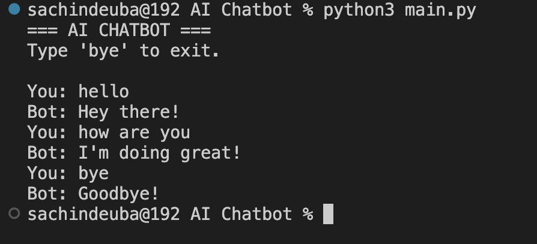

# To-Do List App

Simple Python To-Do List application.

## Features

- Add tasks
- View tasks
- Remove tasks
- Simple terminal interface

## Run

```bash
python3 main.py
```

## Example Output

```txt
==== TO-DO APP ====

1. Add Task
2. View Tasks
3. Remove Task
4. Exit

Enter choice: 1
Enter task: Study Python

Task added!
```

## Screenshot

