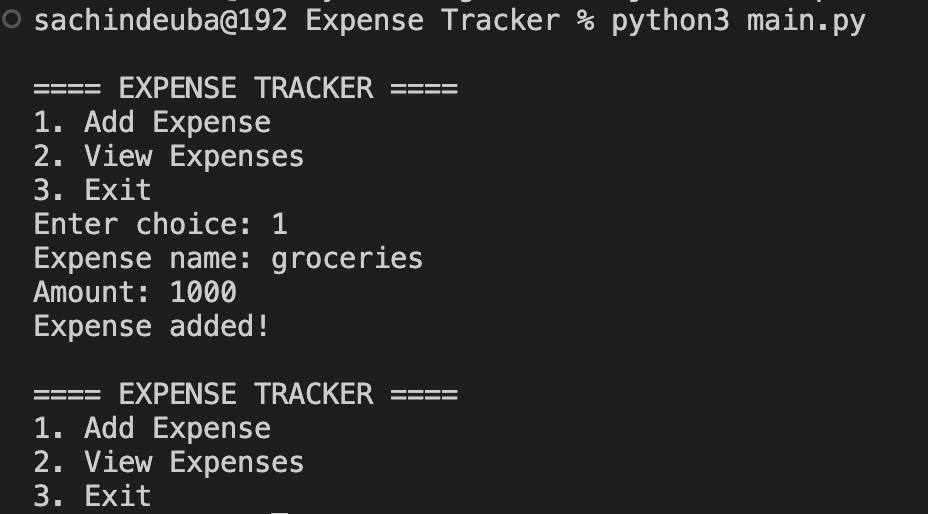

# Expense Tracker

Simple Python expense tracker application.

## Features

- Add expenses
- Store expenses in file
- View saved expenses
- Beginner friendly

## Run

```bash
python3 main.py
```

## Example Output

```txt
==== EXPENSE TRACKER ====

1. Add Expense
2. View Expenses
3. Exit

Enter choice: 1

Expense name: Food
Amount: 500

Expense added!
```

## Screenshot

