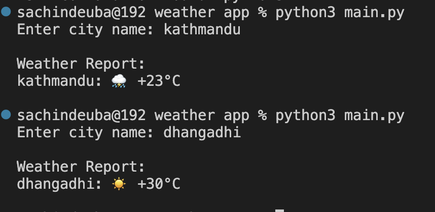

# Weather App

Simple Python weather app using API requests.

## Features

- Get live weather
- Uses requests library
- Beginner API project

## Install

```bash
pip3 install requests
```

## Run

```bash
python3 main.py
```

## Example Output

```txt
Enter city name: Kathmandu

Weather Report:
Kathmandu: 🌦 +24°C
```

## Screenshot

